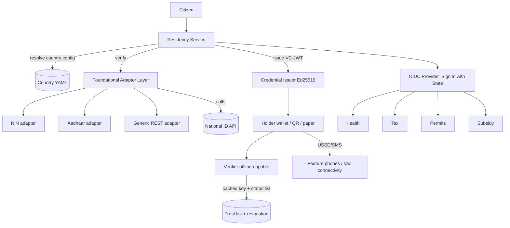

# OpenResidency

An open-source, country-agnostic **subnational Residency ID and Single Sign-On platform**, packaged to be registered and reused as a **Digital Public Good (DPG)**.

It turns this flow into reusable infrastructure any state, province, or county can deploy:

```
Citizen
   -> verify against ANY national/foundational ID API (NIN, Aadhaar, Huduma, ...)
   -> issue a verifiable State Residency credential
   -> one login everywhere (Health, Tax, Permits, Subsidy, ...)
```

The original diagram hard-wired Nigeria's NIN. OpenResidency removes that assumption. The foundational identity source is a configuration choice, the residency credential is a W3C Verifiable Credential, the credential works offline, and cross-sector access is delivered through standards-based OpenID Connect.

## Platform components

This repository is the generic public infrastructure, not a single-country app:

| Component | Where |
|---|---|
| Resident Registry | Prisma `Resident` model + `ResidencyStore` port; admin listing at `/admin/residents` |
| Identity Verification API | `POST /identity/verify`, `POST /identity/challenge` |
| Residency Verification API | `POST /residency/verify`, `GET /residency/{id}` |
| State SSO | OpenID Connect provider at `/oidc`, sector clients preconfigured |
| Consent Framework | first-class revocable records + signed receipts, `/consent/*` |
| Audit Framework | tamper-evident hash-chained log, `/audit`, `/audit/verify` |
| API Gateway | in-app rate limiting + admin key, plus the ingress edge in `deploy/k8s` |
| Interoperability SDK | typed client in `sdk/` (`@openresidency/sdk`) |
| Reference UI | enrollment, verify, and admin consoles at `/app` |
| Kubernetes deployment | raw manifests in `deploy/k8s` and a Helm chart in `deploy/helm` |
| API specifications | OpenAPI 3.1 in `docs/openapi.yaml`, served at `/openapi.yaml` and `/docs` |
| Developer documentation | `docs/ARCHITECTURE.md`, `docs/API.md`, `docs/DEPLOY.md`, `docs/SDK.md`, `docs/DPG.md` |

## Why this is different from a bespoke state ID system

1. **Bring your own foundational ID.** NIN is just one adapter. A new country is onboarded with a YAML file. If its national ID API is a normal REST call, no code is written at all.
2. **Verifiable Credentials, not a lookup database.** Residency is issued as a signed W3C VC (VC-JWT, Ed25519). A verifier confirms authenticity cryptographically, without phoning home.
3. **Offline-first inclusion.** Credentials fit in a single QR code, verify against a cached issuer key with zero connectivity, and revocation is checked against a synced status list. Feature phones are served over USSD and SMS.
4. **SSO across sectors.** The residency system is an OpenID Connect Identity Provider. "Sign in with Katsina" lets Health, Tax, Permits, and Subsidy trust one login, and the citizen's national ID number is never shared with them.

## Architecture



Four clean layers, each swappable:

| Layer | Responsibility | Key files |
|-------|----------------|-----------|
| Foundational | Verify a person against any national ID API | `src/core/foundational/*` |
| Residency | Mint the ResidentID, enforce policy, orchestrate issuance | `src/core/residency/*` |
| Credentials | Issue and verify W3C VCs, DIDs, revocation | `src/core/credentials/*` |
| Inclusion | QR carriage, offline verify, USSD/SMS | `src/core/offline/*` |
| SSO | OpenID Connect IdP for cross-sector login | `src/sso/*` |

The `src/core/*` tree is framework-agnostic and has no NestJS dependency, so it can be embedded in any Node runtime or reused as a library. NestJS is only the delivery mechanism.

## Quickstart

Run the whole pipeline with no database and no live national ID API:

```bash
npm install
npm run smoke
```

This exercises foundational verification, residency issuance, VC-JWT issuance, offline verification, tamper detection, offline revocation, QR carriage, and the USSD menu, and prints a pass/fail summary.

Run the full service (needs Postgres):

```bash
cp .env.example .env
docker compose up -d db
npm run prisma:migrate
npm run start:dev
```

Then open the reference UI at `http://localhost:3000/app/index.html` (enroll, verify,
admin consoles) and the API docs at `http://localhost:3000/docs`.

Or issue a residency in the demo jurisdiction (MOCK provider, even last digit verifies):

```bash
curl -s localhost:3000/residency/issue -H 'content-type: application/json' -d '{
  "countryCode": "ZZ",
  "subnationalUnit": "DX",
  "identifiers": { "nationalId": "12345678902" }
}'
```

You get back a `credentialJwt`. Verify it (server-side, or do it offline in any verifier):

```bash
curl -s localhost:3000/residency/verify -H 'content-type: application/json' -d '{ "credential": "<paste jwt>" }'
```

## Onboarding a new country

Add one file to `config/countries/`. For any REST-based national ID API, point `provider: GENERIC_REST` and describe the call declaratively. See `config/countries/ke.yaml` for a fully code-free example, `ng.yaml` for a NIN deployment, and `in.yaml` for a two-step OTP provider (Aadhaar).

The config controls: which adapter, the endpoint and auth, what the citizen submits, how the response maps to a normalized identity, the assurance policy for issuing residency, and the credential profile (issuer DID, validity, type).

## SSO / OpenID Connect

The service is an OIDC provider mounted at `/oidc`. Discovery is at `/oidc/.well-known/openid-configuration`. Four sector relying parties (health, tax, permits, subsidy) are preconfigured. Each may request `openid profile residency <sector>`. The citizen logs in once, consents per service, and the ID token carries residency claims (`resident_id`, `subnational_unit`, `assurance_level`, ...) but never the national ID number.

## Privacy and security posture

- The raw national ID number never leaves the foundational adapter and is never stored. Only an HMAC-tokenized `subjectRef` (peppered with a deployment secret) is persisted.
- Credentials are signed with Ed25519 for small, offline-verifiable proofs.
- Revocation uses a Bitstring Status List that verifiers cache, so no per-check callback is needed.

## Honest caveats (this is a foundation, not a finished national system)

- **Issuer key management.** The dev server generates an ephemeral key. Production must supply an Ed25519 key from an HSM/KMS via `ISSUER_PRIVATE_JWK`, or, better, keep signing inside the KMS by adapting `VcIssuer`.
- **Authentication factor for SSO.** The bundled interaction login only checks that a ResidentID exists. That is a placeholder. Bind a real factor (SMS/USSD OTP, or a Verifiable Presentation of the residency credential) in `src/sso/interaction.controller.ts` before any real deployment.
- **Proof of residence.** Establishing that a verified person actually resides in a given ward is a policy problem this system records but does not solve on its own. Configure `residency.proofOfResidence` and wire it to your attestation or register source.
- **National ID API contracts vary.** The provided `ng.yaml`, `in.yaml`, and `ke.yaml` mappings are illustrative shapes. Confirm the exact request/response contract and legal basis (consent, data protection) with the identity authority.
- **USSD/SMS delivery** is stubbed at the gateway boundary. Wire your aggregator (for example an MNO or Africa's Talking) in `OfflineController`.

## Digital Public Good alignment

See `docs/DPG.md` for a mapping to the nine DPG Standard indicators, the open standards used (W3C VC, DID, OpenID Connect, Bitstring Status List), and the data-handling notes a reviewer will look for.

## License

Apache-2.0. See `LICENSE` and `NOTICE`.

## Ownership and governance

Owned and stewarded by HarmonizedX Limited. See `GOVERNANCE.md`, `CONTRIBUTING.md`, and
`SECURITY.md`. To publish this as a Digital Public Good, follow `docs/PUBLISHING.md` and
submit with `docs/DPG-SUBMISSION.md`.
