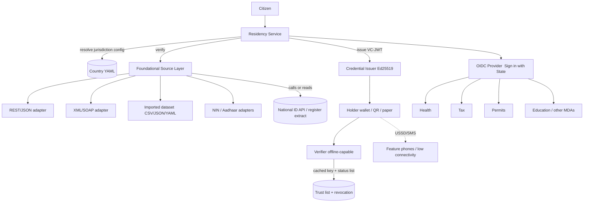

# OpenResidency

An open-source, **jurisdiction-neutral** platform for subnational **Residency ID, verifiable
credentials, and cross-sector single sign-on** — packaged to be registered and reused as a
**Digital Public Good (DPG)**. It is a reusable open core, proven first across Nigeria's states
and reusable, unchanged, by any country.

It turns this flow into infrastructure any state, province, or county can deploy and own:

```
Citizen
   -> verify against ANY national/foundational ID source (NIN, Aadhaar, Huduma, ... — API, XML/SOAP, or an imported register)
   -> issue a verifiable State Residency credential (W3C VC, works offline)
   -> one login across every sector service (Health, Tax, Permits, Subsidy, Education, ...)
```

The foundational identity source is a configuration choice, the residency credential is a W3C
Verifiable Credential, the credential verifies offline, and cross-sector access is delivered
through standards-based OpenID Connect. No jurisdiction's rules are hard-coded in the core.

## Where to start

| If you are… | Go to |
|---|---|
| **Deploying** OpenResidency for a jurisdiction | [Quickstart](#quickstart) → [Onboarding a jurisdiction](#onboarding-a-jurisdiction) → [`docs/DEPLOY.md`](docs/DEPLOY.md) |
| **Integrating** an existing service (an MDA, an education/health platform) | [Integrating a service](#integrating-a-service) → [`docs/API.md`](docs/API.md), [`docs/SDK.md`](docs/SDK.md), [`docs/INTEROP.md`](docs/INTEROP.md) |
| **Evaluating** it as a Digital Public Good / funding it | [DPG alignment](#digital-public-good-alignment) → [`docs/DPG.md`](docs/DPG.md), [`docs/FUNDING-OVERVIEW.md`](docs/FUNDING-OVERVIEW.md) |
| **Understanding the design** | [Architecture](#architecture) → [`docs/ARCHITECTURE.md`](docs/ARCHITECTURE.md), [`docs/RESIDENCY-POLICY.md`](docs/RESIDENCY-POLICY.md) |

## Why this is different from a bespoke state ID system

1. **Bring your own foundational ID, from any kind of source.** NIN is just one adapter. A new
   jurisdiction is onboarded with a YAML file, and the source can be a **REST/JSON API**
   (`GENERIC_REST`), an **XML/SOAP service** (`GENERIC_XML`, common in government and X-Road
   deployments), or an **imported register extract** — CSV, JSON, or YAML — for authorities that
   hand over a data dump rather than an endpoint, or for air-gapped pilots (`DATASET_FILE`, alias
   `IMPORT`). All are configured the same declarative way and share one mapping, so no code is
   written at all.
2. **Verifiable Credentials, not a lookup database.** Residency is issued as a signed W3C VC. A
   verifier confirms authenticity cryptographically, without phoning home. Credentials are issued
   over **OpenID4VCI** and presented over **OpenID4VP**, so a citizen can hold their credential in
   [Inji](https://github.com/mosip/inji-wallet) or any OpenWallet-compatible wallet, and any
   relying party can verify it without integrating anything OpenResidency-specific. See
   [`docs/INTEROP.md`](docs/INTEROP.md).
3. **Offline-first inclusion.** Credentials fit in a single QR code, verify against a cached
   issuer key with zero connectivity, and revocation is checked against a synced status list.
   Feature phones are served over USSD and SMS.
4. **SSO across sectors.** The residency system is an OpenID Connect Identity Provider. One
   "Sign in with <State>" lets Health, Tax, Permits, Subsidy, Education, and any future service
   trust a single login — and the citizen's national ID number is never shared with them.

## Quickstart

Run the whole pipeline with no database and no live national ID source:

```bash
npm install
npm run smoke     # end-to-end core pipeline
npm test          # + XML/dataset sources, OpenID4VCI/VP, SSO, W3C conformance
```

`smoke` exercises foundational verification, residency issuance, VC-JWT issuance, offline
verification, tamper detection, offline revocation, QR carriage, and the USSD menu, and prints a
pass/fail summary.

Run the full service (needs Postgres):

```bash
cp .env.example .env
docker compose up -d db
npm run prisma:migrate
npm run start:dev
```

Then open the reference UI at `http://localhost:3000/app/index.html` (enroll, verify, admin
consoles) and the API docs at `http://localhost:3000/docs`.

Or issue a residency in the demo jurisdiction (MOCK provider, even last digit verifies):

```bash
curl -s localhost:3000/residency/issue -H 'content-type: application/json' -d '{
  "countryCode": "ZZ",
  "subnationalUnit": "DX",
  "identifiers": { "nationalId": "12345678902" }
}'
```

You get back a `credentialJwt`. Verify it (server-side, or offline in any verifier):

```bash
curl -s localhost:3000/residency/verify -H 'content-type: application/json' -d '{ "credential": "<paste jwt>" }'
```

## Onboarding a jurisdiction

Add one file to `config/countries/`. Pick the source that matches the authority:

| Source | `provider` | When | Example |
|---|---|---|---|
| REST / JSON API | `GENERIC_REST` | The national ID API is an ordinary REST call | `ke.yaml` (code-free), `ng.yaml` (NIN), `in.yaml` (Aadhaar OTP) |
| XML / SOAP API | `GENERIC_XML` | The service speaks SOAP/XML (common in government and X-Road stacks) | `xm-xml.yaml` |
| Imported extract | `DATASET_FILE` / `IMPORT` | The authority hands over a CSV/JSON/YAML data dump, or the deployment is air-gapped | `xf-import.yaml` (+ `config/datasets/`) |

All three are described declaratively and share one mapping layer, so the response-mapping and
success-flag dot-paths are written the same way regardless of source; XML simply addresses parsed
elements, and a dataset addresses record fields. The config controls: which source, the
endpoint/auth or dataset path, what the citizen submits, how the response maps to a normalized
identity, the assurance policy for issuing residency, and the credential profile (issuer DID,
validity, type).

## Integrating a service

An existing platform — a ministry service, an education or health portal — taps into ID + auth
**without merging databases**. It keeps its own users and links each one to a `resident_id` at
first authentication. Three integration paths, usable together:

- **Sign in with State (OpenID Connect).** Register the service as a relying party in the country
  YAML (`oidc.relyingParties`: `clientId`, `sector`, `redirectUris`; secret via env). It then uses
  any standard OIDC library to run Authorization Code + PKCE, requesting `openid profile residency
  <sector>`. It receives residency claims (`resident_id`, `subnational_unit`, `assurance_level`, …)
  and **never** the national ID. On first login it maps `resident_id` ⇄ its local account.
- **Credential presentation (OpenID4VP).** If the citizen holds the residency VC in a wallet, the
  service acts as a verifier: request a presentation, verify signature + revocation **offline**
  against the issuer DID. Good for in-person or low-connectivity.
- **Backend verification API.** `POST /residency/verify` (validate a VC), `GET /residency/{id}`
  (status) — via the typed [`@openresidency/sdk`](docs/SDK.md) or plain HTTP.

Residency login proves **who** and **where they reside**, not **entitlement** — the integrating
service still runs its own eligibility rules over the claims it receives. Full walkthrough, with a
worked example and a go-live checklist, in [`docs/INTEGRATION.md`](docs/INTEGRATION.md).

## Architecture



Clean layers, each swappable:

| Layer | Responsibility | Key files |
|-------|----------------|-----------|
| Foundational | Verify a person against any ID source — REST/JSON, XML/SOAP, or an imported register | `src/core/foundational/*` |
| Residency | Mint the ResidentID, enforce policy, orchestrate issuance | `src/core/residency/*` |
| Credentials | Issue and verify W3C VCs, DIDs, revocation | `src/core/credentials/*` |
| Wallet issuance | OpenID4VCI: offer, token, nonce, credential | `src/core/oid4vci/*` |
| Wallet presentation | OpenID4VP: request, direct_post, verification | `src/core/oid4vp/*` |
| Inclusion | QR carriage, offline verify, USSD/SMS | `src/core/offline/*` |
| SSO | OpenID Connect IdP for cross-sector login | `src/sso/*` |

The `src/core/*` tree is framework-agnostic and has no NestJS dependency, so it can be embedded in
any Node runtime or reused as a library. NestJS is only the delivery mechanism.

## Platform components

This repository is the generic public infrastructure, not a single-country app:

| Component | Where |
|---|---|
| Resident Registry | Prisma `Resident` model + `ResidencyStore` port; admin listing at `/admin/residents` |
| Identity Verification API | `POST /identity/verify`, `POST /identity/challenge` |
| Residency Verification API | `POST /residency/verify`, `GET /residency/{id}` |
| State SSO | OpenID Connect provider at `/oidc`, sector clients configured in YAML |
| Consent Framework | first-class revocable records + signed receipts, `/consent/*` |
| Audit Framework | tamper-evident hash-chained log, `/audit`, `/audit/verify` |
| API Gateway | in-app rate limiting + admin key, plus the ingress edge in `deploy/k8s` |
| Interoperability SDK | typed client in `sdk/` (`@openresidency/sdk`) |
| Reference UI | enrollment, verify, and admin consoles at `/app` |
| Kubernetes deployment | raw manifests in `deploy/k8s` and a Helm chart in `deploy/helm` |
| API specifications | OpenAPI 3.1 in `docs/openapi.yaml`, served at `/openapi.yaml` and `/docs` |
| Developer documentation | `docs/ARCHITECTURE.md`, `docs/API.md`, `docs/DEPLOY.md`, `docs/SDK.md`, `docs/DPG.md` |

## Privacy and security posture

- The raw national ID number never leaves the foundational adapter and is never stored. Only an
  HMAC-tokenized `subjectRef` (peppered with a deployment secret) is persisted.
- Credentials are signed with Ed25519 for small, offline-verifiable proofs.
- Revocation uses a Bitstring Status List that verifiers cache, so no per-check callback is needed.
- Every claim release over SSO is consent-gated and recorded in the tamper-evident audit log.

## Honest caveats (this is a foundation, not a finished national system)

- **Issuer key management.** The dev server generates an ephemeral key. Production must supply an
  Ed25519 key from an HSM/KMS via `ISSUER_PRIVATE_JWK`, or, better, keep signing inside the KMS by
  adapting `VcIssuer`.
- **Authentication factor for SSO.** The bundled interaction login only checks that a ResidentID
  exists. That is a placeholder. Bind a real factor (SMS/USSD OTP, or a Verifiable Presentation of
  the residency credential) in `src/sso/interaction.controller.ts` before any real deployment.
- **Cross-service correlation.** The OIDC subject is currently the `resident_id` — stable and the
  same across every relying party. This makes account-linking trivial but lets independent services
  correlate a citizen. Adopt pairwise (PPID) subject identifiers before onboarding third parties
  that should not be able to correlate.
- **Proof of residence.** Establishing that a verified person actually resides in a given ward is a
  policy problem this system records but does not solve on its own. Configure
  `residency.residence` and wire it to your attestation or register source.
- **Source contracts vary.** The provided `ng.yaml`, `in.yaml`, `ke.yaml`, `xm-xml.yaml`, and
  `xf-import.yaml` mappings are illustrative shapes. Confirm the exact request/response contract
  (or extract schema) and legal basis (consent, data protection) with the identity authority.
- **USSD/SMS delivery** is stubbed at the gateway boundary. Wire your aggregator (for example an MNO
  or Africa's Talking) in `OfflineController`.

## Digital Public Good alignment

OpenResidency is built to the DPG Standard: **Apache-2.0**, open standards end to end (W3C
Verifiable Credentials & DIDs, OpenID Connect, OpenID4VCI/VP, W3C Bitstring Status List), and
privacy- and rights-by-design (national-ID tokenization, per-service consent, an enforced
separation of residency from origin/ancestral status). It supports **SDG 16.9** (legal identity for
all) and, through inclusive service access, SDGs 1, 3, and 10. Building on open standards keeps it
interoperable with any conformant wallet, verifier, or relying party and avoids the proprietary
lock-in that would disqualify it as a DPG.

See [`docs/DPG.md`](docs/DPG.md) for the mapping to all nine DPG Standard indicators and what an
adopter completes before production, and [`docs/FUNDING-OVERVIEW.md`](docs/FUNDING-OVERVIEW.md) for
the development-partner overview.

## Standards conformance

Claims about conformance should be checkable, so here is exactly what is and is not verified.

**Checked in CI, on every pull request** (`npm run test:conformance`): the normative requirements
of [VC Data Model 2.0](https://www.w3.org/TR/vc-data-model-2.0/),
[Bitstring Status List 1.0](https://www.w3.org/TR/vc-bitstring-status-list/), and
[VC Data Integrity](https://www.w3.org/TR/vc-di-eddsa/) — asserted against credentials we actually
issue, in both formats, and including that credentials *violating* those requirements are rejected.
CI also drives the full OpenID4VCI and OpenID4VP flows from a wallet's side, and runs the attacks
each is meant to stop.

**Not run in CI, and not claimed:** the official
[`w3c/vc-data-model-2.0-test-suite`](https://github.com/w3c/vc-data-model-2.0-test-suite). It needs
a live server and a database, so it cannot gate a commit. We expose the
[VC-API](https://w3c-ccg.github.io/vc-api/) endpoints it drives, and ship the config and a runner
(`npm run test:w3c`), so that anyone can point it at an instance and see the result for themselves.
[`test/w3c/README.md`](test/w3c/README.md) explains how, and is candid about what we expect it to
surface. **We do not claim to pass it.** If you run it, please open an issue with the output.

## License

Apache-2.0. See `LICENSE` and `NOTICE`.

## Ownership and governance

Owned and stewarded by HarmonizedX Limited. See `GOVERNANCE.md`, `CONTRIBUTING.md`, and
`SECURITY.md`. To publish this as a Digital Public Good, follow `docs/PUBLISHING.md` and submit with
`docs/DPG-SUBMISSION.md`.
