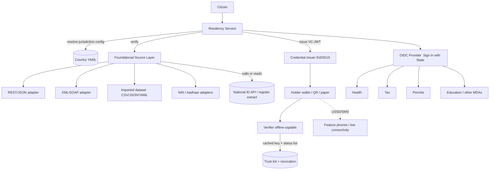

# OpenResidency

**Millions can't prove where they live — and lose access to services because of it.**

OpenResidency lets any state, province or county verify residents against their national ID,
issue a W3C credential that verifies offline, and run one secure login across every sector
service — reaching feature phones over USSD and SMS. It is open-source **subnational trust
infrastructure**: governments establish, manage and exchange verified relationships between
residents and their jurisdictions, giving citizens inclusive, privacy-preserving access to
public services.

**One deployment, one jurisdiction.** Each subnational government runs its own instance, owning
its data, keys and policies. A person holding a family home in one state, employment in another
and study in a third holds **three relationships across three deployments** — no instance ever
holds another jurisdiction's records, because a state asserting authority over its neighbours is
the thing this deliberately does not do. Those relationships reach each other as verifiable
credentials, through the federation trust list, rather than as rows in a shared table.

Packaged to be registered and reused as a **Digital Public Good (DPG)**: a jurisdiction-neutral open
core, proven first across Nigeria's states and reusable, unchanged, by any country.

It turns this flow into infrastructure any state, province, or county can deploy and own:

```
Citizen
   -> verify against ANY national/foundational ID source (NIN, Aadhaar, Huduma, ... — API, XML/SOAP, or an imported register)
   -> issue a verifiable State Residency credential (W3C VC, works offline)
   -> one login across every sector service (Health, Tax, Permits, Subsidy, Education, ...)
```

The foundational identity source is a configuration choice, the residency credential is a W3C
Verifiable Credential, the credential verifies offline, and cross-sector access is delivered
through standards-based OpenID Connect. No jurisdiction's rules are hard-coded in the core —
see [The rules a jurisdiction sets](#the-rules-a-jurisdiction-sets) for exactly which rules
are config and which are invariants nobody can override.

## Where to start

| If you are… | Go to |
|---|---|
| **Deploying** OpenResidency for a jurisdiction | [Quickstart](#quickstart) → [Onboarding a jurisdiction](#onboarding-a-jurisdiction) → [`docs/DEPLOY.md`](docs/DEPLOY.md) |
| **Integrating** an existing service (an MDA, an education/health platform) | [Integrating a service](#integrating-a-service) → [`docs/API.md`](docs/API.md), [`docs/SDK.md`](docs/SDK.md), [`docs/INTEROP.md`](docs/INTEROP.md) |
| **Evaluating** it as a Digital Public Good / funding it | [DPG alignment](#digital-public-good-alignment) → [`docs/DPG.md`](docs/DPG.md) |
| **Running this in a country that already uses MOSIP** | [`docs/MOSIP.md`](docs/MOSIP.md) — eSignet sign-in, IDA authentication, verifying Inji Certify credentials, and how far each is actually verified |
| **Setting a jurisdiction's issuance policy** | [The rules a jurisdiction sets](#the-rules-a-jurisdiction-sets) → `config/countries/ng.yaml` |
| **Understanding the design** | [Architecture](#architecture) → [`docs/ARCHITECTURE.md`](docs/ARCHITECTURE.md) |

## Why this is different from a bespoke state ID system

1. **Bring your own foundational ID, from any kind of source.** NIN is just one adapter. A new
   jurisdiction is onboarded with a YAML file, and the source can be a **REST/JSON API**
   (`GENERIC_REST`), an **XML/SOAP service** (`GENERIC_XML`, common in government and X-Road
   deployments), or an **imported register extract** — CSV, JSON, or YAML — for authorities that
   hand over a data dump rather than an endpoint, or for air-gapped pilots (`DATASET_FILE`, alias
   `IMPORT`). All are configured the same declarative way and share one mapping, so no code is
   written at all.
2. **Verifiable Credentials, not a lookup database.** Residency is issued as a signed W3C VC. A
   verifier confirms authenticity cryptographically, without phoning home. Credentials are issued
   over **OpenID4VCI** and presented over **OpenID4VP**, so a citizen can hold their credential in
   [Inji](https://github.com/mosip/inji-wallet) or any OpenWallet-compatible wallet, and any
   relying party can verify it without integrating anything OpenResidency-specific. Verification
   runs the other way too: credentials signed by an outside issuer with an older proof suite
   (`Ed25519Signature2020/2018`, `RsaSignature2018`) verify here, per federated peer and
   verify-only. See [`docs/INTEROP.md`](docs/INTEROP.md).
3. **Offline-first inclusion.** Credentials fit in a single QR code, verify against a cached
   issuer key with zero connectivity, and revocation is checked against a synced status list.
   Feature phones are served over USSD and SMS.
4. **SSO across sectors.** The residency system is an OpenID Connect Identity Provider. One
   "Sign in with <State>" lets Health, Tax, Permits, Subsidy, Education, and any future service
   trust a single login — and the citizen's national ID number is never shared with them.

## Quickstart

Run the whole pipeline with no database and no live national ID source:

```bash
npm install
npm run smoke     # end-to-end core pipeline
npm test          # + XML/dataset sources, OpenID4VCI/VP, SSO, W3C conformance
```

`smoke` exercises foundational verification, residency issuance, VC-JWT issuance, offline
verification, tamper detection, offline revocation, QR carriage, and the USSD menu, and prints a
pass/fail summary.

Run the full service (needs Postgres):

```bash
cp .env.example .env
docker compose up -d db
npm run prisma:migrate
npm run start:dev
```

Then open the reference UI at `http://localhost:3000/app/index.html` (enroll, verify, admin
consoles) and the API docs at `http://localhost:3000/docs`.

Or issue a residency in the demo jurisdiction (MOCK provider, even last digit verifies).
Issuance is an operator action. The shipped demo config runs `operatorAuth.mode: sharedKey`,
so the key from your `.env` works; a real deployment uses operator SSO and per-operator
API keys instead (see `docs/API.md`):

```bash
curl -s localhost:3000/residency/issue -H 'content-type: application/json' \
  -H "x-admin-key: $ADMIN_API_KEY" -d '{
  "countryCode": "ZZ",
  "subnationalUnit": "DX",
  "identifiers": { "nationalId": "12345678902" }
}'
```

You get back a `credentialJwt`. Verify it (server-side, or offline in any verifier):

```bash
curl -s localhost:3000/residency/verify -H 'content-type: application/json' -d '{ "credential": "<paste jwt>" }'
```

## Onboarding a jurisdiction

Add one file to `config/countries/`. Pick the source that matches the authority:

| Source | `provider` | When | Example |
|---|---|---|---|
| REST / JSON API | `GENERIC_REST` | The national ID API is an ordinary REST call | `ke.yaml` (code-free), `ng.yaml` (NIN), `in.yaml` (Aadhaar OTP) |
| XML / SOAP API | `GENERIC_XML` | The service speaks SOAP/XML (common in government and X-Road stacks) | `xm-xml.yaml` |
| Imported extract | `DATASET_FILE` / `IMPORT` | The authority hands over a CSV/JSON/YAML data dump, or the deployment is air-gapped | `xf-import.yaml` (+ `config/datasets/`) |

All three are described declaratively and share one mapping layer, so the response-mapping and
success-flag dot-paths are written the same way regardless of source; XML simply addresses parsed
elements, and a dataset addresses record fields. The config controls: which source, the
endpoint/auth or dataset path, what the citizen submits, how the response maps to a normalized
identity, the assurance policy for issuing residency, and the credential profile (issuer DID,
validity, type).

## The rules a jurisdiction sets

Issuance is not "match the ID, mint a credential". `ResidencyService.issue()` runs four gates in
order and every one of them reads from the country YAML — which is what "no jurisdiction's rules
are hard-coded" means concretely. Gate 1 is the claimed subnational unit, which must be declared
in `subnationalUnits`; the other three are this block:

```yaml
residency:
  minAssurance: verified              # 2. foundational assurance floor
  applicantBinding:                   # 3. did the applicant PROVE they own this identity?
    required: true
    acceptedMethods: [attended_comparison]
  residence:                          # 4. do they actually live in the claimed unit?
    required: true
    targetLevel: RAL2
    acceptedMethods: [authority_attestation, document, geospatial_match]
    unitMatchRequired: true
    recencyDays: 365
    acceptFoundationalResidence: true
    methodCeiling: { document: RAL1 } # this jurisdiction trusts utility bills less
```

Same code, different YAML:

| Config | Outcome |
|---|---|
| `applicantBinding.required: false` | `ISSUED` |
| `required: true`, enrolment desk attested nothing | `REJECTED APPLICANT_BINDING_REQUIRED_NONE` |
| `required: true`, operator attested in person | `ISSUED` |
| `minAssurance: high`, provider yields `verified` | `REJECTED ASSURANCE_TOO_LOW_verified` |
| `residence.targetLevel: RAL2`, no evidence supplied | `REJECTED PROOF_OF_RESIDENCE_BELOW_RAL2_GOT_RAL0` |
| the same, plus a ward attestation | `ISSUED` |
| a unit absent from `subnationalUnits` | `REJECTED UNKNOWN_SUBNATIONAL_UNIT` |

### Two ladders a jurisdiction picks its position on

**Applicant → identity binding** (`src/core/proofing/binding.ts`). A foundational match proves the
identity *record* is genuine. It does not prove the applicant *owns* it — anyone who knows the
number passes a lookup — so owner proof is a separate, configurable act:

| Method | Strength | What actually happened |
|---|---|---|
| `authoritative_authentication` | 3 | The owner authenticated at the source: eID redirect, or an OTP to the device registered against that identity |
| `face_match` / `fingerprint_match` | 2 | A live capture matched against the template held by the **authoritative** source |
| `attended_comparison` | 1 | An enrolment agent compared the applicant to the evidence in person |
| `none` | 0 | Lookup only — recorded on the credential as such, never silently upgraded |

The strongest of what the provider attested and what the enrolment channel performed wins, and the
achieved method is asserted in the credential, so a verifier can see *how* the holder was bound
rather than taking issuance on trust.

**Residence assurance** (`src/core/proofing/residence.ts`). RAL0 self-declared → RAL3 authoritative
register of record. Each evidence method has a ceiling a jurisdiction may lower but not raise:

| Method | Default ceiling |
|---|---|
| `self_declared` | RAL0 — the floor, and never counts toward a required level above it |
| `register_declared_residence` — the residence locality the foundational source returned | RAL1 |
| `document`, `authority_attestation`, `geospatial_match` | RAL2 |

With `recencyDays` set, evidence that is older than that — or carries no date at all — is capped at
RAL1 and cannot reach the higher levels. Origin/indigeneity is deliberately absent from this table:
it is not an evidence method and cannot be configured into one.

### The Resident ID format

The human-facing ID is a configurable ruleset, set per country and overridable per unit, so a
federation can run one state on the default scheme and another on a statutory numbering scheme:

```yaml
subnationalUnits:
  - { code: KN, name: Kano, level: state }   # inherits the country default: KN-04G6-2W3R-5
  - code: KT
    name: Katsina
    level: state
    residentId:                              # a flat 10-digit statutory scheme
      alphabet: numeric                      # crockford32 | numeric | alphanumeric | hex
      groups: [10]
      separator: ''
      prefix: { mode: none }                 # unit | country | static | none
      checkDigit: { enabled: true, algorithm: luhn }   # crockford-sha256 | luhn | mod97-10
```

Config is rejected at load time if the random body carries under 32 bits of entropy, or if a
numeric checksum is asked to run over a non-numeric prefix. There is deliberately **no** free-form
template that could interpolate a submitted value, so the foundational number can never end up
embedded in a public, shareable identifier.

### What a jurisdiction cannot change

Configurability stops where it would let a deployment configure away the guarantees a relying party
depends on:

| Invariant | Where |
|---|---|
| The raw national ID is never stored — only an HMAC-tokenized `subjectRef` | `src/core/residency/ports.ts` |
| Origin/ancestry is never accepted as proof of residence | no such value exists in `ResidenceEvidenceMethod` |
| A repeat enrolment returns the existing record, never a second ID | `ResidencyService.issue()` |
| Every credential issued to a resident shares one revocation bit, so revoking revokes all of them | `ResidencyService.mintForHolder()` |
| Gate order, and that every gate fails closed | `ResidencyService.issue()` |

Adding a *new* binding or residence method is a code change, not config. Both are closed
vocabularies on purpose: a deployment that could invent its own evidence type would be emitting
credentials no verifier elsewhere has any way to interpret.

## Integrating a service

An existing platform — a ministry service, an education or health portal — taps into ID + auth
**without merging databases**. It keeps its own users and links each one to a `resident_id` at
first authentication. Three integration paths, usable together:

- **Sign in with State (OpenID Connect).** Register the service as a relying party in the country
  YAML (`oidc.relyingParties`: `clientId`, `sector`, `scopes`, `redirectUris`; secret via env). It
  then uses any standard OIDC library to run Authorization Code + PKCE, requesting `openid profile
  <sector>`. It receives residency claims (`subnational_unit`, `assurance_level`, …) and **never**
  the national ID. On first login it maps the `sub` ⇄ its local account. Gate sensitive actions on
  the standard `acr` claim rather than `assurance_level` — see the caveat below.

  The `sub` is **pairwise**: each service sees a different, stable identifier for the same citizen,
  so two MDAs cannot join their records on it. The `resident_id` claim — which *is* the same
  everywhere — comes from the `residency` scope and is granted only to relying parties with a
  lawful basis for holding the number itself.
- **Credential presentation (OpenID4VP).** If the citizen holds the residency VC in a wallet, the
  service acts as a verifier: request a presentation, verify signature + revocation **offline**
  against the issuer DID. Good for in-person or low-connectivity.
- **Backend verification API.** `POST /residency/verify` (validate a VC), `GET /residency/{id}`
  (status) — via the typed [`@openresidency/sdk`](docs/SDK.md) or plain HTTP.

Residency login proves **who** and **where they reside**, not **entitlement** — the integrating
service still runs its own eligibility rules over the claims it receives. Full walkthrough, with a
worked example and a go-live checklist, in [`docs/INTEGRATION.md`](docs/INTEGRATION.md).

## Architecture


```mermaid
flowchart TD
  C[Citizen] --> R[Residency Service]
  R -->|resolve jurisdiction config| CFG[(Country YAML)]
  R -->|verify| F[Foundational Source Layer]
  F --> A1[REST/JSON adapter]
  F --> A2[XML/SOAP adapter]
  F --> A3[Imported dataset  CSV/JSON/YAML]
  F --> A4[NIN / Aadhaar adapters]
  F -->|calls or reads| EXT[(National ID API / register extract)]
  R -->|issue VC-JWT| VC[Credential Issuer  Ed25519]
  VC --> WALLET[Holder wallet / QR / paper]
  WALLET --> V[Verifier  offline-capable]
  V -->|cached key + status list| TRUST[(Trust list + revocation)]
  R --> IDP[OIDC Provider  Sign in with State]
  IDP --> H[Health]
  IDP --> T[Tax]
  IDP --> P[Permits]
  IDP --> E[Education / other MDAs]
  WALLET -. USSD/SMS .-> LOWNET[Feature phones / low connectivity]
```

Clean layers, each swappable:

| Layer | Responsibility | Key files |
|-------|----------------|-----------|
| Foundational | Verify a person against any ID source — REST/JSON, XML/SOAP, or an imported register | `src/core/foundational/*` |
| Residency | Mint the ResidentID, enforce policy, orchestrate issuance | `src/core/residency/*` |
| Credentials | Issue and verify W3C VCs, DIDs, revocation | `src/core/credentials/*` |
| Wallet issuance | OpenID4VCI: offer, token, nonce, credential | `src/core/oid4vci/*` |
| Wallet presentation | OpenID4VP: request, direct_post, verification | `src/core/oid4vp/*` |
| Inclusion | QR carriage, offline verify, USSD/SMS | `src/core/offline/*` |
| SSO | OpenID Connect IdP for cross-sector login | `src/sso/*` |
| Open data | Aggregate non-PII statistics as JSON/CSV, with small-cell suppression | `src/core/statistics/*` |

The `src/core/*` tree is framework-agnostic and has no NestJS dependency, so it can be embedded in
any Node runtime or reused as a library. NestJS is only the delivery mechanism.

## Platform components

This repository is the generic public infrastructure, not a single-country app:

| Component | Where |
|---|---|
| Resident Registry | Prisma `Resident` model + `ResidencyStore` port; admin listing at `/admin/residents` |
| Identity Verification API | `POST /identity/verify`, `POST /identity/challenge` |
| Residency Verification API | `POST /residency/verify`, `GET /residency/{id}` |
| State SSO | OpenID Connect provider at `/oidc`, sector clients configured in YAML |
| Consent Framework | first-class revocable records + signed receipts, `/consent/*` |
| Audit Framework | tamper-evident hash-chained log, `/audit`, `/audit/verify` |
| API Gateway | in-app rate limiting + admin key, plus the ingress edge in `deploy/k8s` |
| Interoperability SDK | typed client in `sdk/` (`@openresidency/sdk`) |
| Reference UI | enrollment, verify, and admin consoles at `/app` |
| Kubernetes deployment | raw manifests in `deploy/k8s` and a Helm chart in `deploy/helm` |
| API specifications | OpenAPI 3.1 in `docs/openapi.yaml`, served at `/openapi.yaml` and `/docs` |
| Developer documentation | `docs/ARCHITECTURE.md`, `docs/API.md`, `docs/DEPLOY.md`, `docs/SDK.md`, `docs/DPG.md` |

## Privacy and security posture

- The raw national ID number never leaves the foundational adapter and is never stored. Only an
  HMAC-tokenized `subjectRef` (peppered with a deployment secret) is persisted.
- Credentials are signed with Ed25519 for small, offline-verifiable proofs.
- Revocation uses a Bitstring Status List that verifiers cache, so no per-check callback is needed.
- Every claim release over SSO is consent-gated and recorded in the tamper-evident audit log.
  Consent is revocable and revocation is enforced, not just noted: withdrawing a consent
  destroys the OIDC grant it authorized and revokes every token issued under it, so the
  relying party stops receiving claims immediately rather than at token expiry.

## Honest caveats (this is a foundation, not a finished national system)

- **Issuer key management.** Signing goes through a `Signer` port, so the private key can stay
  inside an HSM and never enter the process: set `ISSUER_KEY_BACKEND=pkcs11` and point
  `PKCS11_LIBRARY` / `PKCS11_KEY_LABEL` at your token. `npm run smoke:hsm` exercises the whole path
  against SoftHSM, including that the key cannot be extracted. `ISSUER_KEY_BACKEND=env` (a JWK in
  the environment) remains supported but keeps real key material in process. The dev server still
  generates an ephemeral key, and now **refuses to boot in production** rather than silently
  issuing credentials no verifier trusts.

  For cloud custody, `ISSUER_KEY_BACKEND=gcpkms` signs in Google Cloud KMS (`GCP_KMS_KEY_NAME`,
  algorithm `EC_SIGN_ED25519`, protection level `HSM` for hardware). `npm run smoke:gcpkms`
  covers it against a mock Cloud KMS — that proves the wire protocol and issuance, **not** real
  GCP IAM or endpoints, so run one signature against a real key version before going live.
  `ISSUER_KEY_BACKEND=awskms` signs in AWS KMS (`AWS_KMS_KEY_ID`, key spec
  `ECC_NIST_EDWARDS25519`), covered by `npm run smoke:awskms` against a mock — same caveat, run
  one real signature first. AWS CloudHSM also works via `pkcs11`.

  On **Azure**, use `pkcs11` with Dedicated HSM or Luna Cloud HSM — both are Thales Luna
  appliances exposing a PKCS#11 library, so they should work with the adapter unchanged, though
  **this is untested here**: the interface matches, but nobody has run it against a real
  appliance. **Azure Key Vault and Managed HSM cannot be used at all**, for two independent
  reasons: they offer no Ed25519 curve (only P-256/P-256K/P-384/P-521 with ES256/384/512), and
  their Sign operation is documented as "sign hash" — the caller supplies a digest. PureEdDSA
  signs the *message* and derives its nonce from it, so it cannot accept a pre-hash. Both AWS
  and GCP had to expose an explicit raw-message mode to support Ed25519; Azure Key Vault has no
  equivalent.

  **How far each backend is verified:** `pkcs11` is tested end to end against SoftHSM. `gcpkms`
  and `awskms` are tested against mock services — protocol and issuance, *not* real IAM,
  endpoints, or credential chains. Azure-via-PKCS#11 is untested. Whichever you choose, sign one
  credential against the real key and verify it before opening enrollment.
- **SSO signing key.** `oidc-provider` signs id_tokens internally and accepts only literal private
  JWKs, so the SSO layer cannot use an HSM-held key. It takes its own key via `OIDC_SIGNING_JWK`,
  which is required when the issuer key is in an HSM.
- **Authentication factor for SSO.** Sign-in binds a real factor: a Verifiable Presentation of the
  residency credential (primary), with a one-time code to the registered number as fallback. Naming
  a ResidentID is *not* sufficient — `npm run smoke:sso` asserts that a bare ID, a stolen
  credential, and a revoked credential all fail to sign in. Delivery is configured, not stubbed:
  name an SMS aggregator in the `messaging` block (Africa's Talking, Twilio, Termii, or any REST
  gateway via `GENERIC_HTTP`) and a `contactDirectory`. What a deployment still owns is the
  aggregator contract itself.
- **Cross-service correlation.** The OIDC subject is **pairwise**: each relying party sees a
  different, stable identifier for the same citizen, so independent services cannot join records on
  it. The correlatable `resident_id` claim is granted per relying party via `scopes`, not to
  everyone by default — both halves are needed, since a universally readable `resident_id` would
  defeat pairwise subjects entirely.
- **`assurance_level` resolves to a registry, and still is not an authentication signal.** The
  value released over SSO now resolves through the Assurance Registry (`src/core/assurance/`)
  rather than being a bare string: each canonical profile is versioned and attributed to the
  authority that governs it, and each provider publishes an ORCS §8.1 mapping stating which
  profile its verification reaches, at what version, by what method, and what it does not cover.
  A provider config must state its level explicitly — `foundational.assuranceOnSuccess` is
  required, and a config omitting it is refused at load rather than defaulting to a high rung.
  What remains true is the separation, and it is deliberate: the registry describes **identity**
  assurance only, and carries no authentication dimension, because folding one into the other is
  the conflation ORCS §8 exists to prevent. So **step up on the standard OIDC `acr` claim**
  (`urn:openresidency:aal1`–`aal3`, with `amr` naming the factors used) — it is derived from the
  factors actually presented, always released with the `openid` scope, and is the only one of the
  two that says anything about *this* sign-in. `assurance_level` tells a relying party how well
  the person was identified, never how strongly they just authenticated.
- **Proof of residence.** Establishing that a verified person actually resides in a given ward is a
  policy problem this system evaluates but does not settle on its own: `residency.residence`
  configures which evidence methods are accepted, the level each can reach, whether the evidence
  must match the claimed unit, and how fast it goes stale. What it does *not* yet do is version or
  sign that policy, so a decision cannot be reliably reproduced after the policy changes — record
  the ruleset alongside any decision you need to defend later. Wire it to your attestation or
  register source.
- **Ending a residency is a separate act from revoking a credential.** A record carries an ORCS
  §6.2 lifecycle status, so a jurisdiction can record that somebody left — with the reason, the
  deciding authority and the moment — rather than only killing their credential. The two stay
  separate on purpose: one is a statement about a person's relationship to the jurisdiction, the
  other about a key, and ending a residency does **not** revoke the credential as a side effect.
  A caller doing both makes both calls, and both are audited. Residency is permanent until ended:
  validity dates are recorded, but nothing lapses on its own
  ([ADR-0007](docs/adr/0007-residency-status-is-lifecycle.md)). Revocation, separately, preserves
  what ORCS §10 requires — reason, authority, timestamp and the appeal path a holder contests it
  through — and is refused rather than recorded blank when any of the four is missing. Suspension
  is published on its own status list, so a verifier can tell a suspended credential from a
  revoked one.
- **Who decides is a jurisdiction's choice, and it carries an obligation.** Whether an
  enrolment is decided by a person or by the software is not a switch — it follows from which
  binding and residence methods a jurisdiction accepts, and each decision records which it was.
  A deployment whose accepted methods permit a decision with nobody in the loop **must declare
  where an affected person obtains human review, or it refuses to start**: NDPA 2023 s.37, GDPR
  Article 22 and Convention 108+ all require human intervention, the right to be heard, and a
  reviewer able to reach a different answer. Refusals record which of the two decided them.
- **Enrolment capture is out of scope.** This issues a credential, not a card. There is no
  portrait capture or storage (a photo returned by a foundational source is dropped, never
  persisted), no printed ID-slip renderer, and no schema for local demographic fields — ward,
  polling unit, occupation, address. The `Resident` model holds the minimized attributes carried
  into the credential and nothing else. A jurisdiction replacing an existing enrolment-desk system
  keeps that system, or builds the capture layer on top; the citizen-facing artifact here is the
  credential and its QR, which is what verifies offline.
- **Source contracts vary.** The provided `ng.yaml`, `in.yaml`, `ke.yaml`, `xm-xml.yaml`, and
  `xf-import.yaml` mappings are illustrative shapes. Confirm the exact request/response contract
  (or extract schema) and legal basis (consent, data protection) with the identity authority.
- **USSD as an inclusion channel.** The USSD webhook is wired to real delivery, not stubbed: a
  status lookup or a login code goes out as SMS to the number registered against the record —
  through the same `messaging` path as web sign-in, never back down the USSD session, so the
  endpoint cannot be used to enumerate residents. What a deployment still supplies is the
  aggregator contract itself.

## Digital Public Good alignment

OpenResidency is built to the DPG Standard: **Apache-2.0**, open standards end to end (W3C
Verifiable Credentials & DIDs, OpenID Connect, OpenID4VCI/VP, W3C Bitstring Status List), and
privacy- and rights-by-design (national-ID tokenization, per-service consent, an enforced
separation of residency from origin/ancestral status). It supports **SDG 16.9** (legal identity for
all) and, through inclusive service access, SDGs 1, 3, and 10. Building on open standards keeps it
interoperable with any conformant wallet, verifier, or relying party and avoids the proprietary
lock-in that would disqualify it as a DPG.

See [`docs/DPG.md`](docs/DPG.md) for the mapping to all nine DPG Standard indicators, the honest
gaps, what an adopter completes before production, and the registry submission pack.

## Standards conformance

Claims about conformance should be checkable, so here is exactly what is and is not verified.

**Checked in CI, on every pull request** (`npm run test:conformance`): the normative requirements
of [VC Data Model 2.0](https://www.w3.org/TR/vc-data-model-2.0/),
[Bitstring Status List 1.0](https://www.w3.org/TR/vc-bitstring-status-list/), and
[VC Data Integrity](https://www.w3.org/TR/vc-di-eddsa/) — asserted against credentials we actually
issue, in both formats, and including that credentials *violating* those requirements are rejected.
CI also drives the full OpenID4VCI and OpenID4VP flows from a wallet's side, and runs the attacks
each is meant to stop.

**Interoperating with systems we do not control** (`npm run smoke:ld-suites`,
`smoke:upstream-oidc`, `smoke:mosip-ida` — all gated on every pull request). Three suites cover
the directions where being subtly wrong means accepting something we should have refused:

- **Credentials signed by other issuers.** We issue one proof type (`eddsa-rdfc-2022`) and always
  will, but we *verify* `Ed25519Signature2020`, `Ed25519Signature2018` and `RsaSignature2018` —
  the suites a MOSIP/Inji Certify-era issuer actually signs with — accepted per peer, never
  globally, and verify-only: no code path here can emit one. The credentials in that suite were
  produced by the **reference implementations**, not by this codebase, so it measures
  interoperability rather than agreement with ourselves.
- **Signing in at an external identity provider.** `private_key_jwt` with the assertion audienced
  at the token endpoint, unconditional PKCE, provider keys pinned rather than fetched, and
  nested-JWT userinfo decrypted *and then* signature-verified. An `acr` a deployment has not
  explicitly mapped fails the sign-in rather than being graded at runtime.
- **MOSIP ID Authentication's encrypted envelope**, driven against a test server that decrypts the
  session key, decrypts the request block, recomputes the digest, checks the certificate
  thumbprint and verifies the detached JWS — so a client that got the GCM IV placement, the
  digest case or the base64 padding wrong fails exactly as it would in production. eKYC
  attribute retrieval is covered too: the response is a JWE wrapping a JWS, and a payload that
  decrypts perfectly but was signed by somebody else is refused.

`npm run conformance:mosip` is the authoritative statement of that state — it re-runs each suite,
adds a check that no control flow in `src/core` branches on a vendor identifier, and **gates the
build**, exiting non-zero on any non-PASS. Quote the suite, not a document.

**What none of it establishes:** nothing here has run against a live MOSIP deployment. These
verify against reference implementations and published behaviour; a credential from a real Inji
Certify instance, a registered eSignet client, and a MISP partner agreement are all things CI
cannot hold. [`docs/MOSIP.md`](docs/MOSIP.md) draws that line explicitly, surface by surface. No
MOSIP certification, compliance or partnership is claimed.

**Not run in CI, and not claimed:** the official
[`w3c/vc-data-model-2.0-test-suite`](https://github.com/w3c/vc-data-model-2.0-test-suite). It needs
a live server and a database, so it cannot gate a commit. We expose the
[VC-API](https://w3c-ccg.github.io/vc-api/) endpoints it drives, and ship the config and a runner
(`npm run test:w3c`), so that anyone can point it at an instance and see the result for themselves.
[`test/w3c/README.md`](test/w3c/README.md) explains how, and is candid about what we expect it to
surface. **We do not claim to pass it.** If you run it, please open an issue with the output.

## License

Apache-2.0. See `LICENSE` and `NOTICE`.

## Ownership and governance

Owned and stewarded by HarmonizedX Limited. See `GOVERNANCE.md`, `CONTRIBUTING.md`, and
`SECURITY.md`. To publish this as a Digital Public Good, follow `docs/PUBLISHING.md` and submit
using the registry submission pack at the end of [`docs/DPG.md`](docs/DPG.md).
