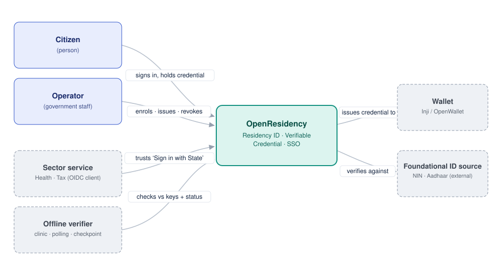
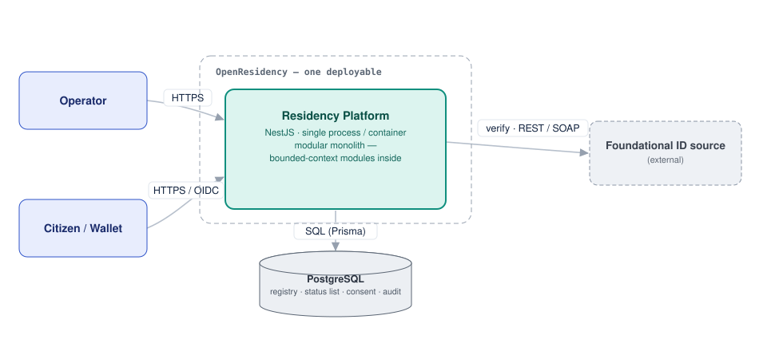
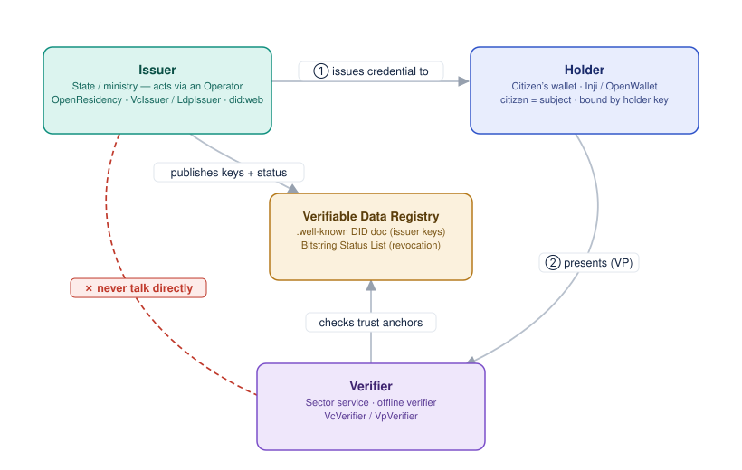

# 2. Hexagonal, modular architecture (bounded contexts, ports & adapters)

- Status: Proposed
- Date: 2026-07-30
- Related: [ADR-0001](0001-record-architecture-decisions.md), [`docs/ARCHITECTURE.md`](../ARCHITECTURE.md)
- Supersedes: —

> **This ADR does not change the running architecture.** OpenResidency is already hexagonal
> (a framework-free core behind ports, a thin NestJS delivery layer, swappable adapters). This
> record *formalizes* that design, states the conventions the codebase follows as it grows, and
> captures two targeted refinements. Behaviour, the HTTP/OIDC surface, the standards
> (W3C VC, OIDC, OID4VCI/VP), and every security invariant are unchanged.

## Context and problem statement

The core (`src/core/**`) already imports no `@nestjs`, `@prisma`, or `express` — it is
unit-testable by the smoke scripts and embeddable as a library. Two smells motivate the only
*code* changes this ADR endorses:

1. **`src/platform/platform.service.ts`** is a ~750-line composition god object that every
   controller routes through — one choke point coupling otherwise-independent subsystems.
2. **Primitive identifiers** — `residentId: string` carries no type-level guarantee of format or
   checksum; validity is a function callers must remember to invoke.

Everything else here is documentation and convention, layered on the architecture that exists.

## Decision drivers

- Preserve the framework-free, embeddable core — a Digital Public Good requirement.
- Keep each security/privacy invariant *owned* by a clear boundary and enforceable.
- Contain change within subsystem boundaries; stop drift toward a ball of mud.
- Stay **incremental** — no big-bang rewrite; the system runs throughout.

## Considered options and decisions

| Axis | Options | Decision |
|---|---|---|
| Decomposition | one blob · package/folder **by bounded context** | **by context** (they already exist as `src/core/*` seams; each owns its model + invariants) |
| Wiring | keep `PlatformService` god object · **per-context DI modules** | **per-context modules**; controllers inject use-cases |
| Identifiers | primitive `string` · **typed value object** | **typed `ResidentId`** extending an `Id` base |
| Inbound layer name | `interface` · **`adapters` (driving)** | **`adapters`** — the controller is a driving adapter, not "the interface" |
| Outbound layer name | `adapter/out` · **`infrastructure` (driven)** | **`infrastructure`** — the widely-recognised term; holds both external adapters and local technical services |
| Cross-boundary calls | reach internals · **published application API only** | **application API only**; enforced by tooling |
| Events coordination | orchestration sagas · **choreography (listeners)** | **choreography** for now; no orchestration saga until a stateful async workflow demands one |
| Reliability of async side-effects | best-effort everywhere · **outbox for must-not-lose** | **transactional outbox** for must-not-lose events; in-process bus for best-effort |
| Event-bus mechanism | Nest CQRS `EventBus` · **`EventEmitter2`** · external broker | **`EventEmitter2`** (`@nestjs/event-emitter`), in-process; broker deferred; CQRS `EventBus` only if CQRS is adopted |
| Domain kernel | vendor from another product · **own it** | **own it** (Model A) — self-contained, keeps the DPG license-clean |

## The architecture, in C4

**Level 1 — system context.** People and external systems around OpenResidency; no internals.



**Level 2 — containers.** The honest runtime topology is a **modular monolith**: one NestJS
application (one process) and one PostgreSQL database. Internal boundaries (Level 3) keep it
from rotting; a context can be extracted to its own service later if it ever needs independent
scaling.



**Level 3 — components (the hexagon, per context).** Driving adapters on the inbound edge,
driven/infrastructure adapters on the outbound edge, a framework-free core between them. Data and
control flow left → right; source-code dependencies point **inward** to the domain.


**The Verifiable-Credentials trust triangle.** Issuer and verifier never talk directly — they meet
through the Verifiable Data Registry (published keys + Bitstring Status List). Subject ≠ holder;
operator ≠ issuer.



## Bounded contexts and layering

Contexts: **residency · foundational · credentials · sso · consent · operator · audit ·
messaging** (an OID4VP/verify `presentation` slice may fold into `credentials`/`sso` — open).

Each context is four layers (naming: singular layer, plural bucket):

```
<context>/
  domain/          aggregates · value-objects · events        (PURE, kernel only)
  application/     use-cases · ports (owned) · dtos · listeners (PURE)
  adapters/        http/ · ussd/                                (inbound / driving)
  infrastructure/  persistence/ · signer/ · clients/            (outbound / driven)
```

### The dependency rule (enforced in CI)

`adapters → application → domain → shared-kernel`; **domain imports only the kernel**; one context
reaches another **only through its published `application` API**, never into its `domain` or
`infrastructure`. Enforced by `dependency-cruiser` (see Phase 0), e.g.:

```js
{ name: 'core-no-framework',
  from: { path: '^src/core/' },
  to:   { path: 'node_modules/(@nestjs|@prisma/client|express)' }, severity: 'error' }
```

## Domain kernel and providers

- **`shared-kernel`** (Model A — we own it): the base DDD classes `AggregateRoot`, `Entity`,
  `ValueObject`, `Id`, `DomainEvent`, and domain exceptions. Reimplemented (not vendored), ~6 tiny
  files, zero dependencies. `ResidentId` extends `Id`; `Resident` extends `AggregateRoot<ResidentId>`.
- **Identity-source adapters** (NIN/NIMC, Aadhaar, GENERIC_REST, GENERIC_XML/SOAP, DATASET) are
  driven adapters implementing the `foundational` context's `FoundationalSource` port — a config
  choice per jurisdiction, no core change to add one.

## Events and high availability

- **Declare** domain events in `domain/`, **handle** them in `application/` (listeners),
  **transport** them in `infrastructure/`. Aggregates raise; the use-case dispatches **after commit**.
- **Synchronous core**: issuance (verify → bind → residence → mint → sign) stays one atomic
  transaction. Events drive only decoupled side-effects (status-list refresh on revoke,
  notifications, audit).
- **Choreography via listeners**; no orchestration saga yet.
- **HA-correct minimum**: a **transactional outbox** for must-not-lose events (revocation →
  status list, audit); an in-process bus for best-effort (SMS); **no message broker** while it
  is a single deployable; stateless app instances + DB failover + idempotent handlers.
- **Mechanism**: the in-process bus is **`EventEmitter2`** (`@nestjs/event-emitter`). Domain
  events stay in-process; only cross-*service* integration events would ever move to a broker
  (deferred). If CQRS is adopted later, Nest's CQRS `EventBus` is the drop-in replacement.

## Consequences

**Positive**
- The framework-free core promise becomes explicit and CI-enforced.
- Each invariant has an owning context; change stays contained.
- Removing the god object makes wiring legible and testable; typed ids make invalid identifiers
  unrepresentable.

**Negative / cost**
- More folders and cross-context calls than a flat app.
- A small, ongoing boundary-discipline (the dependency-cruiser rules).

**Neutral**
- No change to behaviour, APIs, standards, or the config-driven jurisdiction model.

## Deferred / open (each a future ADR when taken)

- **Monorepo** (`libs/` + `apps/`, pnpm + Turborepo, Nest as one app) — recorded as direction,
  **not adopted here**. Its own ADR when the multi-app need (worker/cli/non-Nest) is concrete.
- Per-context packages vs one `core` library.
- CQRS (command/query buses) vs plain use-cases.
- Async **process managers** for stateful flows (NIMC face-match binding, OID4VCI deferred issuance).
- Application purity (`@Injectable` in application vs framework-free classes wired by the module) —
  leaning framework-free.
- Authentication for `/identity/verify` — tracked via coordinated disclosure, not detailed here.

## Implementation phases

- **Phase 0 (this ADR):** record the architecture + add `dependency-cruiser` rules on the
  *current* folders (`core-no-framework`, `no-circular`) — both green today, zero code moved.
- **Phase 1:** introduce `shared-kernel` + typed `ResidentId`; replace `PlatformService` with
  per-context modules, one context (`residency`) reshaped end-to-end as the reference.

## Links

- Concepts & architecture portal: https://open-residency.harmonizedx.com
- [`docs/ARCHITECTURE.md`](../ARCHITECTURE.md), [`src/core/`](../../src/core)
